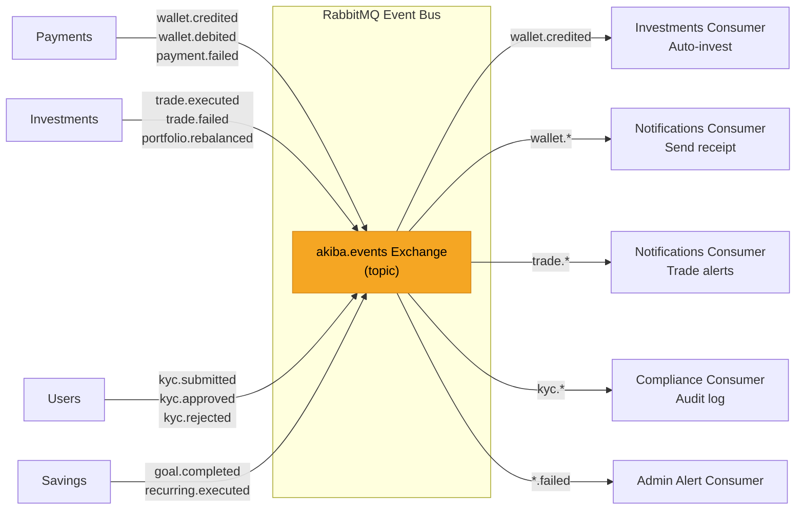
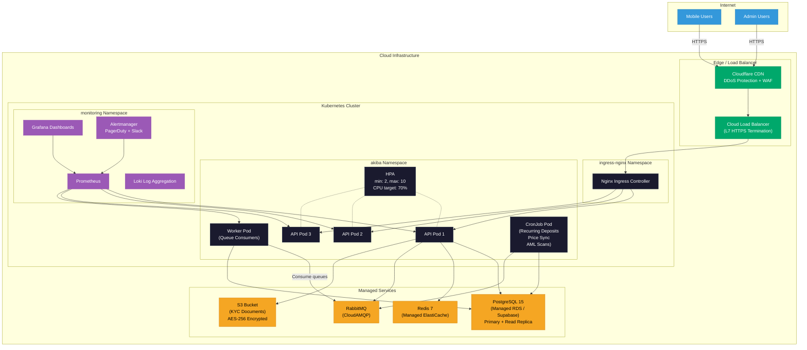

# Akiba Platform Architecture

## Microservices Architecture

The Akiba platform follows a modular monolith architecture built on NestJS, with clear module boundaries that can be extracted into independent microservices as scale demands. All client traffic flows through a single API gateway that handles authentication, rate limiting, and request routing.

```mermaid
graph TB
    subgraph Clients["Client Applications"]
        MobileApp["React Native Mobile App<br/>(iOS + Android)"]
        AdminWeb["Next.js Admin Dashboard"]
    end

    subgraph Gateway["API Gateway Layer"]
        API["NestJS API Server<br/>api.akiba.sn<br/>JWT Auth / Rate Limiting / CORS"]
    end

    subgraph Modules["Service Modules"]
        Auth["Auth Module<br/>OTP, JWT, PIN"]
        Users["Users Module<br/>Profiles, KYC, Risk"]
        Payments["Payments Module<br/>Deposits, Withdrawals"]
        Portfolios["Portfolios Module<br/>Robo-advisor, Allocation"]
        Investments["Investments Module<br/>Trades, Holdings"]
        Savings["Savings Module<br/>Goals, Recurring"]
        Markets["Markets Module<br/>Assets, Prices, Indices"]
        Education["Education Module<br/>Lessons, Quizzes, Badges"]
        Notifications["Notifications Module<br/>Push, SMS, In-App"]
        Compliance["Compliance Module<br/>AML, Sanctions, Audit"]
        Admin["Admin Module<br/>User Mgmt, Reports, KYC Review"]
        Health["Health Module<br/>Readiness, Liveness"]
    end

    subgraph ExternalServices["External Integrations"]
        PISPI["PI-SPI Gateway<br/>(BCEAO Instant Payments)<br/>Wave, Orange Money, Free Money"]
        SGI["Partner SGI Broker<br/>(BRVM Trade Execution)<br/>Equities, Bonds, T-Bills"]
        SmileID["Smile ID<br/>(KYC Verification)<br/>ID Check + Liveness"]
        Firebase["Firebase Cloud Messaging<br/>(Push Notifications)"]
        SMS["Twilio / Africa's Talking<br/>(SMS OTP + Alerts)"]
    end

    subgraph DataLayer["Data & Infrastructure"]
        PG["PostgreSQL 15<br/>Primary Database<br/>Double-entry Ledger"]
        Redis["Redis 7<br/>Session Cache / OTP Store<br/>Rate Limit Counters"]
        RabbitMQ["RabbitMQ<br/>Async Event Bus<br/>Trade Queue / Notifications"]
        S3["S3-Compatible Storage<br/>(KYC Documents<br/>User Uploads)"]
    end

    %% Client to Gateway
    MobileApp -->|"HTTPS / REST"| API
    AdminWeb -->|"HTTPS / REST"| API

    %% Gateway to Modules
    API --> Auth
    API --> Users
    API --> Payments
    API --> Portfolios
    API --> Investments
    API --> Savings
    API --> Markets
    API --> Education
    API --> Notifications
    API --> Compliance
    API --> Admin
    API --> Health

    %% Module to External
    Auth -->|"Send OTP"| SMS
    Users -->|"ID Verification"| SmileID
    Users -->|"Upload Documents"| S3
    Payments -->|"Deposit / Withdraw"| PISPI
    Investments -->|"Execute Trades"| SGI
    Markets -->|"Price Feed"| SGI
    Notifications -->|"Push"| Firebase
    Notifications -->|"SMS"| SMS

    %% Module to Data
    Auth -->|"OTP + Sessions"| Redis
    Auth --> PG
    Users --> PG
    Payments --> PG
    Payments -->|"Idempotency Keys"| Redis
    Portfolios --> PG
    Investments --> PG
    Investments -->|"Trade Queue"| RabbitMQ
    Savings --> PG
    Markets --> PG
    Markets -->|"Price Cache"| Redis
    Education --> PG
    Notifications --> PG
    Notifications -->|"Delivery Queue"| RabbitMQ
    Compliance --> PG
    Admin --> PG

    %% Webhook callbacks
    PISPI -->|"Payment Webhooks"| Payments

    %% Inter-module communication
    Payments -.->|"Wallet Credited Event"| RabbitMQ
    RabbitMQ -.->|"Auto-invest Trigger"| Investments
    RabbitMQ -.->|"Send Receipt"| Notifications
    Compliance -.->|"AML Scan"| RabbitMQ

    classDef client fill:#3498DB,stroke:#2980B9,color:#fff
    classDef gateway fill:#00A86B,stroke:#008F5B,color:#fff
    classDef module fill:#1A1A2E,stroke:#16213E,color:#fff
    classDef external fill:#F5A623,stroke:#D4891E,color:#000
    classDef data fill:#E74C3C,stroke:#C0392B,color:#fff

    class MobileApp,AdminWeb client
    class API gateway
    class Auth,Users,Payments,Portfolios,Investments,Savings,Markets,Education,Notifications,Compliance,Admin,Health module
    class PISPI,SGI,SmileID,Firebase,SMS external
    class PG,Redis,RabbitMQ,S3 data
```

## Inter-Module Communication

Modules communicate through two mechanisms:

1. **Synchronous** -- Direct service injection within the NestJS dependency injection container (e.g., `PaymentsService` calls `NotificationsService.send()` after crediting a wallet).
2. **Asynchronous** -- RabbitMQ event bus for decoupled workflows (e.g., a `wallet.credited` event triggers the auto-invest logic in the Investments module and a receipt notification in the Notifications module).

## Deployment Architecture

The platform is containerized and deployed to a Kubernetes cluster. Each component runs as a separate deployment with horizontal pod autoscaling.

## Container Image Strategy

| Image | Base | Purpose |
|-------|------|---------|
| `akiba/api` | `node:20-alpine` | NestJS API server serving all REST endpoints |
| `akiba/worker` | `node:20-alpine` | RabbitMQ consumers for async event processing |
| `akiba/cron` | `node:20-alpine` | Scheduled jobs (recurring deposits, price sync, AML batch scans) |
| `akiba/admin` | `node:20-alpine` | Next.js admin dashboard (SSR) |
| `akiba/migrations` | `node:20-alpine` | Prisma migration runner (init container) |

## Environment Configuration

All secrets are stored in Kubernetes Secrets and injected as environment variables:

| Variable | Description |
|----------|-------------|
| `DATABASE_URL` | PostgreSQL connection string |
| `REDIS_URL` | Redis connection string |
| `RABBITMQ_URL` | RabbitMQ AMQP connection string |
| `JWT_SECRET` | JWT signing secret (RS256 private key) |
| `JWT_REFRESH_SECRET` | Refresh token signing secret |
| `PISPI_API_KEY` | PI-SPI gateway API key |
| `PISPI_WEBHOOK_SECRET` | HMAC secret for webhook signature verification |
| `SGI_API_KEY` | Partner SGI broker API credentials |
| `SMILE_ID_API_KEY` | Smile ID KYC verification API key |
| `SMILE_ID_PARTNER_ID` | Smile ID partner identifier |
| `FIREBASE_SERVICE_ACCOUNT` | Firebase Cloud Messaging service account JSON |
| `TWILIO_ACCOUNT_SID` | Twilio SMS account SID |
| `TWILIO_AUTH_TOKEN` | Twilio SMS auth token |
| `S3_BUCKET` | S3 bucket name for document storage |
| `S3_ACCESS_KEY` | S3 access key |
| `S3_SECRET_KEY` | S3 secret key |
