# Database Entity Relationship Diagram

## Overview

The Akiba database is built on PostgreSQL 15 using Prisma ORM. It implements a double-entry bookkeeping ledger for all financial operations, tiered KYC with document storage, and a full education/gamification system.

All primary keys are UUID v4 (`gen_random_uuid()`). Monetary values are stored as `BigInt` in FCFA (CFA Franc) to avoid floating-point precision issues. Fractional share quantities use `Decimal(20, 8)`.

## Entity Relationship Diagram

```mermaid
erDiagram
    User {
        uuid id PK
        varchar phone_number UK
        varchar email UK
        varchar full_name
        date date_of_birth
        varchar national_id_number
        enum kyc_status "pending | submitted | verified | rejected"
        enum kyc_tier "tier_0 | tier_1 | tier_2 | tier_3"
        enum risk_profile "conservative | balanced | aggressive"
        boolean is_halal_only
        enum preferred_language "fr | wo | en"
        varchar referral_code UK
        uuid referred_by FK
        varchar pin_hash
        timestamp created_at
        timestamp updated_at
    }

    UserDevice {
        uuid id PK
        uuid user_id FK
        varchar device_id
        varchar device_name
        varchar platform "ios | android | web"
        varchar push_token
        boolean is_active
        timestamp last_login_at
        timestamp created_at
    }

    KycDocument {
        uuid id PK
        uuid user_id FK
        varchar document_type "national_id_front | national_id_back | selfie | proof_of_address"
        varchar s3_key
        enum status "pending | submitted | verified | rejected"
        uuid reviewed_by
        text review_notes
        varchar external_verification_id
        timestamp created_at
        timestamp updated_at
    }

    Wallet {
        uuid id PK
        uuid user_id FK
        enum wallet_type "cash | investment | savings"
        bigint balance_fcfa
        varchar pi_spi_alias
        varchar currency "XOF"
        timestamp created_at
    }

    Transaction {
        uuid id PK
        uuid user_id FK
        uuid wallet_id FK
        enum type "deposit | withdrawal | investment | dividend | fee | transfer | refund"
        bigint amount_fcfa
        bigint fee_fcfa
        enum status "pending | processing | completed | failed | reversed"
        varchar pi_spi_reference
        varchar external_reference
        text description
        json metadata
        varchar idempotency_key UK
        timestamp created_at
        timestamp completed_at
    }

    LedgerEntry {
        uuid id PK
        uuid transaction_id FK
        varchar account_type "user_cash | user_investment | platform_fees | pi_spi_clearing"
        varchar account_id
        bigint debit_fcfa
        bigint credit_fcfa
        timestamp created_at
    }

    Asset {
        uuid id PK
        varchar ticker UK
        varchar name
        enum asset_type "equity | government_bond | treasury_bill | mutual_fund | sukuk | savings_vault"
        varchar market "BRVM"
        boolean is_sharia_compliant
        bigint current_price_fcfa
        varchar currency "XOF"
        enum risk_level "very_low | low | medium | high"
        text description
        varchar sector
        boolean is_active
        float sharia_debt_ratio
        float sharia_interest_ratio
        float sharia_haram_revenue
        float sharia_receivable_ratio
        timestamp sharia_last_screened
        timestamp last_price_update
        timestamp created_at
    }

    AssetPriceHistory {
        uuid id PK
        uuid asset_id FK
        bigint price_fcfa
        bigint open_fcfa
        bigint high_fcfa
        bigint low_fcfa
        bigint volume
        date date
        timestamp created_at
    }

    Portfolio {
        uuid id PK
        uuid user_id FK
        varchar name
        enum portfolio_type "robo_managed | self_directed | halal | savings_goal"
        json target_allocation
        bigint total_value_fcfa
        boolean is_active
        timestamp last_rebalanced_at
        timestamp created_at
        timestamp updated_at
    }

    Holding {
        uuid id PK
        uuid portfolio_id FK
        uuid asset_id FK
        decimal quantity "Decimal(20,8)"
        decimal average_cost_fcfa "Decimal(20,4)"
        bigint current_value_fcfa
        timestamp created_at
        timestamp updated_at
    }

    TradeOrder {
        uuid id PK
        uuid portfolio_id FK
        uuid asset_id FK
        enum side "buy | sell"
        decimal quantity_requested "Decimal(20,8)"
        decimal quantity_filled "Decimal(20,8)"
        bigint amount_fcfa
        enum status "pending | queued | executing | filled | partially_filled | cancelled | failed"
        uuid batch_id
        timestamp executed_at
        timestamp created_at
    }

    SavingsGoal {
        uuid id PK
        uuid user_id FK
        uuid portfolio_id FK "unique, optional"
        varchar name
        enum goal_type "emergency_fund | house | education | hajj | wedding | business | custom"
        bigint target_amount_fcfa
        bigint current_amount_fcfa
        date target_date
        bigint auto_deposit_amount_fcfa
        enum auto_deposit_frequency "daily | weekly | biweekly | monthly"
        boolean is_active
        timestamp completed_at
        timestamp created_at
        timestamp updated_at
    }

    RecurringDeposit {
        uuid id PK
        uuid user_id FK
        uuid savings_goal_id FK
        uuid portfolio_id FK
        bigint amount_fcfa
        enum frequency "daily | weekly | biweekly | monthly"
        varchar source_wallet_type "wave | orange_money | bank"
        varchar pi_spi_mandate_reference
        date next_execution_date
        date last_execution_date
        boolean is_active
        int failure_count
        timestamp created_at
    }

    LearningPath {
        uuid id PK
        varchar slug UK
        varchar title_fr
        varchar title_wo
        varchar title_en
        text description
        varchar icon_url
        int sort_order
        varchar unlocks_feature
        boolean is_active
        timestamp created_at
    }

    Lesson {
        uuid id PK
        uuid learning_path_id FK
        varchar slug UK
        varchar title_fr
        varchar title_wo
        varchar title_en
        text content_fr
        text content_wo
        text content_en
        int sort_order
        json quiz_questions
        boolean is_active
        timestamp created_at
    }

    LearningProgress {
        uuid id PK
        uuid user_id FK
        uuid lesson_id FK
        boolean is_completed
        int quiz_score "0-100"
        timestamp completed_at
        timestamp created_at
    }

    Badge {
        uuid id PK
        varchar slug UK
        varchar name_fr
        varchar name_wo
        varchar name_en
        text description
        varchar icon_url
        json criteria
        timestamp created_at
    }

    UserBadge {
        uuid id PK
        uuid user_id FK
        uuid badge_id FK
        timestamp earned_at
    }

    Notification {
        uuid id PK
        uuid user_id FK
        enum channel "push | sms | email | in_app"
        varchar title_fr
        varchar title_wo
        text body_fr
        text body_wo
        json data
        boolean is_read
        timestamp sent_at
        timestamp read_at
        timestamp created_at
    }

    AuditLog {
        uuid id PK
        uuid user_id FK
        uuid admin_id
        varchar action
        varchar entity_type
        uuid entity_id
        json details
        varchar ip_address
        varchar user_agent
        timestamp created_at
    }

    AmlAlert {
        uuid id PK
        uuid user_id FK
        varchar alert_type "threshold_exceeded | structuring | rapid_movement | sanctions_match"
        varchar severity "low | medium | high | critical"
        text description
        uuid_array transaction_ids
        varchar status "open | investigating | escalated | resolved | str_filed"
        uuid reviewed_by
        text review_notes
        varchar str_reference
        timestamp created_at
        timestamp resolved_at
    }

    SanctionsList {
        uuid id PK
        varchar source "OFAC | EU | BCEAO | UN"
        varchar full_name
        varchar_array aliases
        varchar date_of_birth
        varchar nationality
        date list_date
        boolean is_active
        timestamp created_at
        timestamp updated_at
    }

    AdminUser {
        uuid id PK
        varchar email UK
        varchar full_name
        varchar password_hash
        enum role "super_admin | admin | compliance_officer | support"
        boolean is_active
        timestamp last_login_at
        timestamp created_at
        timestamp updated_at
    }

    %% ===== RELATIONSHIPS =====

    %% User domain
    User ||--o{ UserDevice : "has devices"
    User ||--o{ KycDocument : "submits documents"
    User ||--o| User : "referred by"

    %% Wallet and transaction domain
    User ||--o{ Wallet : "owns wallets"
    User ||--o{ Transaction : "initiates transactions"
    Wallet ||--o{ Transaction : "contains transactions"
    Transaction ||--o{ LedgerEntry : "produces ledger entries"

    %% Portfolio and investment domain
    User ||--o{ Portfolio : "owns portfolios"
    Portfolio ||--o{ Holding : "contains holdings"
    Portfolio ||--o{ TradeOrder : "generates trade orders"
    Asset ||--o{ Holding : "held in portfolios"
    Asset ||--o{ AssetPriceHistory : "has price history"

    %% Savings domain
    User ||--o{ SavingsGoal : "sets savings goals"
    User ||--o{ RecurringDeposit : "schedules recurring deposits"
    SavingsGoal ||--o{ RecurringDeposit : "funded by recurring deposits"
    SavingsGoal ||--o| Portfolio : "backed by portfolio"

    %% Education and gamification domain
    LearningPath ||--o{ Lesson : "contains lessons"
    Lesson ||--o{ LearningProgress : "tracked per user"
    User ||--o{ LearningProgress : "progresses through lessons"
    Badge ||--o{ UserBadge : "awarded to users"

    %% Notification domain
    User ||--o{ Notification : "receives notifications"

    %% Compliance and audit domain
    User ||--o{ AuditLog : "generates audit entries"
```

## Table Summary

| Domain | Table | Row Estimate (Year 1) | Key Indexes |
|--------|-------|----------------------|-------------|
| User | `users` | 50,000 | `phone_number`, `email`, `referral_code`, `kyc_status` |
| User | `user_devices` | 75,000 | `user_id` |
| User | `kyc_documents` | 100,000 | `user_id`, `status` |
| Wallet | `wallets` | 150,000 | `user_id`, `pi_spi_alias` |
| Wallet | `transactions` | 2,000,000 | `user_id`, `wallet_id`, `status`, `pi_spi_reference`, `type+status` |
| Wallet | `ledger_entries` | 6,000,000 | `transaction_id`, `account_type+account_id` |
| Market | `assets` | 500 | `ticker`, `asset_type`, `is_sharia_compliant` |
| Market | `asset_price_history` | 500,000 | `asset_id+date` |
| Portfolio | `portfolios` | 60,000 | `user_id`, `portfolio_type` |
| Portfolio | `holdings` | 300,000 | `portfolio_id`, `asset_id` |
| Portfolio | `trade_orders` | 500,000 | `portfolio_id`, `status`, `batch_id` |
| Savings | `savings_goals` | 80,000 | `user_id`, `goal_type`, `is_active` |
| Savings | `recurring_deposits` | 40,000 | `user_id`, `next_execution_date+is_active` |
| Education | `learning_paths` | 20 | `slug` |
| Education | `lessons` | 200 | `learning_path_id+sort_order` |
| Education | `learning_progress` | 500,000 | `user_id` |
| Education | `badges` | 50 | `slug` |
| Education | `user_badges` | 200,000 | `user_id` |
| Notification | `notifications` | 5,000,000 | `user_id+is_read`, `created_at` |
| Compliance | `audit_logs` | 10,000,000 | `user_id`, `action`, `entity_type+entity_id`, `created_at` |
| Compliance | `aml_alerts` | 5,000 | `user_id`, `status`, `severity` |
| Compliance | `sanctions_list` | 10,000 | `full_name`, `source` |
| Admin | `admin_users` | 20 | `email` |

## Partitioning Strategy

High-volume tables should be partitioned by `created_at` for query performance and data lifecycle management:

- `transactions` -- Monthly range partitions
- `ledger_entries` -- Monthly range partitions
- `audit_logs` -- Monthly range partitions, with cold storage archival after 12 months
- `notifications` -- Monthly range partitions, auto-delete after 6 months
- `asset_price_history` -- Monthly range partitions
