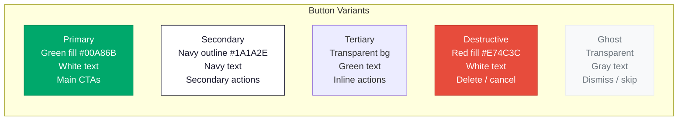

# Akiba Design System

## Brand

- **Product Name**: Akiba
- **Tagline**: Investir, c'est grandir. (To invest is to grow.)
- **Mission**: Democratize access to BRVM capital markets for West African retail investors, starting from 1,000 FCFA, with built-in financial education and Sharia-compliant options.
- **Voice**: Trustworthy, encouraging, clear. Avoids jargon. Speaks in the user's language (French, Wolof, English).

---

## Color Palette

| Swatch | Name | Hex | RGB | Usage |
|--------|------|-----|-----|-------|
|  | Primary Green | `#00A86B` | `rgb(0, 168, 107)` | Primary actions, positive indicators, CTA buttons, success states, portfolio gains |
|  | Deep Navy | `#1A1A2E` | `rgb(26, 26, 46)` | Primary text, headers, navigation bars, dark backgrounds |
|  | Warm Gold | `#F5A623` | `rgb(245, 166, 35)` | Accent highlights, badges, rewards, premium features, pending states |
|  | Soft White | `#F8F9FA` | `rgb(248, 249, 250)` | Screen backgrounds, card surfaces, light mode base |
|  | Light Gray | `#E9ECEF` | `rgb(233, 236, 239)` | Borders, dividers, disabled states, secondary backgrounds |
|  | Alert Red | `#E74C3C` | `rgb(231, 76, 60)` | Errors, portfolio losses, destructive actions, critical alerts |
|  | Sky Blue | `#3498DB` | `rgb(52, 152, 219)` | Informational states, links, secondary actions, education content |

### Dark Mode Overrides

| Token | Light Mode | Dark Mode |
|-------|-----------|-----------|
| `--bg-primary` | `#F8F9FA` | `#0D0D1A` |
| `--bg-card` | `#FFFFFF` | `#1A1A2E` |
| `--text-primary` | `#1A1A2E` | `#F8F9FA` |
| `--text-secondary` | `#6C757D` | `#ADB5BD` |
| `--border` | `#E9ECEF` | `#2D2D44` |

---

## Typography

**Font Family**: `Inter` (Latin) / `Noto Sans` (fallback for Wolof diacritics)

| Style | Size | Weight | Line Height | Letter Spacing | Usage |
|-------|------|--------|-------------|----------------|-------|
| Display | 32px | 700 (Bold) | 40px (1.25) | -0.5px | Hero numbers (portfolio value) |
| H1 | 28px | 700 (Bold) | 36px (1.29) | -0.3px | Screen titles |
| H2 | 24px | 600 (SemiBold) | 32px (1.33) | -0.2px | Section headers |
| H3 | 20px | 600 (SemiBold) | 28px (1.4) | 0px | Card titles |
| Body Large | 18px | 400 (Regular) | 28px (1.56) | 0px | Primary content, instructions |
| Body | 16px | 400 (Regular) | 24px (1.5) | 0px | Default text, descriptions |
| Body Small | 14px | 400 (Regular) | 20px (1.43) | 0.1px | Secondary text, captions |
| Caption | 12px | 500 (Medium) | 16px (1.33) | 0.2px | Labels, timestamps, metadata |
| Button | 16px | 600 (SemiBold) | 24px (1.5) | 0.5px | Button labels |
| Tab | 12px | 500 (Medium) | 16px (1.33) | 0.3px | Tab bar labels |

**Minimum text size**: 16px for body content, 12px absolute minimum for captions. Never go below 12px.

**Numeric font feature**: Use `tabular-nums` for all financial figures to ensure columns align.

---

## Spacing System

Based on a **4px grid**. All spacing values are multiples of 4.

| Token | Value | Usage |
|-------|-------|-------|
| `--space-xs` | 4px | Tight inline gaps, icon-to-label |
| `--space-sm` | 8px | Small gaps between related elements |
| `--space-md` | 12px | Default padding inside compact components |
| `--space-base` | 16px | Standard padding, card inner padding, list item gaps |
| `--space-lg` | 20px | Section gaps |
| `--space-xl` | 24px | Large section separation |
| `--space-2xl` | 32px | Screen section separation |
| `--space-3xl` | 40px | Major layout gaps |
| `--space-4xl` | 48px | Top-of-screen padding (below safe area) |

### Component Spacing Rules

- Card internal padding: `16px`
- Space between cards in a list: `12px`
- Screen horizontal margin: `16px` (phone), `24px` (tablet)
- Space between a section header and its content: `12px`
- Space between form fields: `16px`
- Bottom navigation height: `56px` + safe area inset
- FAB position: `16px` from right edge, `16px` above bottom nav

---

## Components

### Buttons



| Property | Large | Medium (default) | Small |
|----------|-------|-------------------|-------|
| Height | 56px | 48px | 36px |
| Min width | 100% (full width) | 120px | 80px |
| Padding H | 24px | 20px | 16px |
| Border radius | 12px | 12px | 8px |
| Font size | 18px / SemiBold | 16px / SemiBold | 14px / Medium |
| Icon size | 24px | 20px | 16px |

**States**:
- **Default**: Base colors as defined
- **Pressed**: 10% darker background, scale(0.98) transform
- **Disabled**: 40% opacity, no pointer events
- **Loading**: Spinner replaces label, button width preserved to prevent layout shift

### Cards

| Property | Value |
|----------|-------|
| Background | `#FFFFFF` (light) / `#1A1A2E` (dark) |
| Border radius | 16px |
| Shadow | `0 2px 8px rgba(0, 0, 0, 0.08)` |
| Padding | 16px |
| Border | none (light) / `1px solid #2D2D44` (dark) |

Card types:
- **Asset Card**: Ticker + name + price + daily change (green/red)
- **Portfolio Card**: Name + total value + return % + mini sparkline chart
- **Goal Card**: Name + progress bar + amount + target date
- **Transaction Card**: Icon + type + amount + date + status badge
- **Lesson Card**: Thumbnail + title + progress indicator + duration

### Inputs

| Property | Value |
|----------|-------|
| Height | 48px |
| Border | `1.5px solid #E9ECEF` |
| Border (focus) | `2px solid #00A86B` |
| Border (error) | `2px solid #E74C3C` |
| Border radius | 12px |
| Padding | 12px 16px |
| Background | `#FFFFFF` |
| Font size | 16px |
| Label | 14px Medium, positioned above, `#6C757D` |
| Placeholder | 16px Regular, `#ADB5BD` |
| Helper text | 12px Regular, `#6C757D` |
| Error text | 12px Regular, `#E74C3C` |

**OTP Input**: 6 individual boxes, 48x48px each, 8px gap, auto-advance on digit entry.

**PIN Input**: 4 dots, filled on entry, obscured after 300ms.

**Amount Input**: Large centered display (32px Bold), currency label (FCFA) suffix, quick-amount chips below.

### Badges / Status Pills

| Variant | Background | Text Color | Usage |
|---------|-----------|------------|-------|
| Success | `#00A86B` @ 15% | `#00A86B` | Completed, verified, gain |
| Warning | `#F5A623` @ 15% | `#D4891E` | Pending, in review |
| Error | `#E74C3C` @ 15% | `#E74C3C` | Failed, rejected, loss |
| Info | `#3498DB` @ 15% | `#3498DB` | Processing, informational |
| Neutral | `#E9ECEF` | `#6C757D` | Inactive, default |

Badge specs: Height 24px, border-radius 12px (pill), padding 4px 10px, font 12px Medium.

---

## Icons

**Library**: [Phosphor Icons](https://phosphoricons.com/) (Regular weight for navigation, Bold weight for active states)

**Size Scale**:
- Navigation: 24px
- In-content: 20px
- Inline with text: 16px
- Badge decorations: 12px

**Custom Icons**: Asset type icons (equity chart, bond certificate, money vault, sukuk crescent) are custom SVGs maintaining the Phosphor style grid (24x24 viewbox, 1.5px stroke).

**Color Rules**:
- Navigation icons: `#6C757D` (inactive), `#00A86B` (active)
- Action icons: Inherit parent text color
- Status icons: Match status color (green/gold/red/blue)
- Decorative icons: `#ADB5BD`

---

## Layout

### Grid System

- **Screen width**: Full bleed, 16px horizontal margins
- **Content max width**: 428px (phone), 768px (tablet)
- **Columns**: 4-column grid at 375px width, 16px gutters
- **Card grids**: 2 columns for asset tiles, full width for transaction list items

### Safe Areas

```
+----------------------------------+
|        Status Bar (safe)         |  <- iOS: 44px, Android: 24px
+----------------------------------+
|                                  |
|        Screen Content            |
|        (scrollable area)         |
|                                  |
|                                  |
|     *** THUMB ZONE ***           |  <- Bottom 60% of screen
|     Primary actions here         |
|                                  |
+----------------------------------+
|       Bottom Navigation          |  <- 56px + safe area
+----------------------------------+
```

### Bottom Navigation

5 tabs, each with icon (24px) + label (12px):

| Tab | Icon | Label (FR) | Label (EN) |
|-----|------|-----------|-----------|
| Home | `house` | Accueil | Home |
| Markets | `chart-line-up` | Marches | Markets |
| Invest | `plus-circle` | Investir | Invest |
| Learn | `graduation-cap` | Apprendre | Learn |
| Profile | `user-circle` | Profil | Profile |

The center "Invest" tab uses a raised FAB-style button (Primary Green, 48px circle) to draw attention.

### Thumb Zone Principle

All primary actions are placed in the bottom 60% of the screen:
- CTA buttons anchored to bottom
- Bottom sheets for confirmations (not center modals)
- Pull-to-refresh for content updates
- Swipe gestures for navigation between related screens

---

## Accessibility

### WCAG AA Compliance

| Requirement | Target | Implementation |
|-------------|--------|----------------|
| Color contrast (normal text) | 4.5:1 minimum | Deep Navy on Soft White = 15.4:1 |
| Color contrast (large text) | 3:1 minimum | Primary Green on White = 4.6:1 |
| Touch target size | 48x48px minimum | All interactive elements meet this |
| Focus indicator | Visible focus ring | 2px solid #3498DB, 2px offset |
| Screen reader | Full support | All images have alt text, semantic HTML roles |
| Motion | Respect `prefers-reduced-motion` | Disable animations when preference is set |
| Text scaling | Support up to 200% | Layouts adapt via flexbox, no fixed heights on text containers |
| Language | `lang` attribute set correctly | Switches with user language preference |

### Color-Blind Safety

- Gains/losses use green (#00A86B) and red (#E74C3C) but are always accompanied by directional arrows and +/- signs
- Status indicators use both color and text labels
- Charts include pattern fills as an alternative to color-only differentiation

### Touch Targets

- Minimum 48x48px for all tappable elements
- Minimum 8px gap between adjacent touch targets
- List items: full-width tap area, minimum 56px height
- Close/dismiss buttons: 48x48px despite visual icon being 24px

---

## Design Principles

### 1. Simplicity First
Every screen serves one clear purpose. If it needs explanation, it needs redesigning. Maximum 3 actions per screen. Progressive disclosure over information overload.

### 2. Mobile-First, Mobile-Only (Initially)
Designed for 375px viewport minimum. The admin dashboard is the only web interface. All user interactions are optimized for one-handed, thumb-driven phone usage.

### 3. Bilingual by Default
Every string has French and Wolof variants. Layout accommodates text expansion (Wolof strings can be 30% longer than French). Numbers and currencies are always formatted with FCFA locale conventions (space thousands separator: `50 000 FCFA`).

### 4. High Contrast, Low Bandwidth
- Images are lazy-loaded and compressed (WebP, max 100KB)
- Skeleton screens during loading (not spinners)
- Charts use SVG (not bitmaps)
- Dark mode reduces OLED battery consumption
- Minimum contrast ratios enforced across all theme variants

### 5. Progressive Disclosure
Users see complexity only when they are ready:
- Tier 0: Browse and learn
- Tier 1: Invest with guided portfolios
- Tier 2+: Self-directed trading and advanced features
- Education modules unlock features (e.g., complete "Bond Basics" to see bond detail screens)

### 6. Trust Signals Everywhere
- Show BCEAO regulatory compliance badge on financial screens
- Display real-time data freshness timestamps on prices
- Transaction receipts with unique reference numbers
- Lock icon on all input screens handling sensitive data
- Clear fee disclosure before every transaction confirmation

### 7. Offline-Aware
- Cache portfolio values and transaction history for offline viewing
- Show stale data with timestamp ("Last updated 2 hours ago")
- Queue actions taken offline and sync when connectivity returns
- Gray overlay with "No connection" bar (not a blocking modal)
- Education content is downloadable for offline reading

---

## Motion and Animation

### Principles

- Animations provide feedback, not decoration
- Total animation duration never exceeds 400ms
- Use ease-out curves for elements entering, ease-in for elements leaving
- Respect the `prefers-reduced-motion` media query: replace motion with instant opacity changes

### Duration Scale

| Token | Duration | Easing | Usage |
|-------|----------|--------|-------|
| `--duration-instant` | 100ms | `ease-out` | Button press feedback, toggle switches |
| `--duration-fast` | 200ms | `ease-out` | Sheet open/close, tab transitions |
| `--duration-normal` | 300ms | `ease-in-out` | Screen transitions, card expand/collapse |
| `--duration-slow` | 400ms | `ease-in-out` | Complex layout shifts, chart data updates |

### Specific Animations

| Element | Animation | Duration |
|---------|-----------|----------|
| Screen transition | Slide left/right + fade | 300ms |
| Bottom sheet | Slide up from bottom | 200ms |
| Button press | Scale to 0.98 + darken | 100ms |
| Success state | Checkmark draw + pulse | 400ms |
| Portfolio value | Count up (number ticker) | 300ms |
| Card appear (list) | Fade in + translate Y 8px, stagger 50ms | 200ms each |
| Pull to refresh | Spring physics on indicator | Variable |
| Confetti (first investment) | Particle burst | 2000ms (one-time) |
| Chart line draw | SVG stroke-dashoffset | 400ms |
| Skeleton shimmer | Linear gradient sweep | 1500ms loop |
| Toast notification | Slide down + auto-dismiss | 200ms in, 3s hold, 200ms out |

---

## Component Hierarchy

```mermaid
graph TD
    subgraph Foundations["Foundations"]
        Colors["Colors"]
        Typography["Typography"]
        Spacing["Spacing"]
        Icons["Icons"]
        Motion["Motion"]
    end

    subgraph Atoms["Atoms"]
        Button["Button"]
        Input["Input"]
        Badge["Badge"]
        Avatar["Avatar"]
        Chip["Chip"]
        Spinner["Spinner"]
        Divider["Divider"]
        Icon["Icon"]
    end

    subgraph Molecules["Molecules"]
        Card["Card"]
        ListItem["List Item"]
        BottomSheet["Bottom Sheet"]
        TabBar["Tab Bar"]
        SearchBar["Search Bar"]
        OTPInput["OTP Input"]
        AmountInput["Amount Input"]
        ProgressBar["Progress Bar"]
        Toast["Toast"]
        EmptyState["Empty State"]
    end

    subgraph Organisms["Organisms"]
        AssetCard["Asset Card"]
        PortfolioCard["Portfolio Card"]
        GoalCard["Goal Card"]
        TxCard["Transaction Card"]
        PriceChart["Price Chart"]
        AllocationPie["Allocation Pie"]
        LessonCard["Lesson Card"]
        NotifItem["Notification Item"]
        KYCUploader["KYC Document Uploader"]
    end

    subgraph Templates["Screen Templates"]
        ListScreen["List Screen<br/>(header + search + scrollable list)"]
        DetailScreen["Detail Screen<br/>(header + hero + sections)"]
        FormScreen["Form Screen<br/>(header + fields + sticky CTA)"]
        DashboardScreen["Dashboard Screen<br/>(hero value + card grid)"]
        OnboardingScreen["Onboarding Screen<br/>(illustration + text + CTA)"]
    end

    Foundations --> Atoms
    Atoms --> Molecules
    Molecules --> Organisms
    Organisms --> Templates

    classDef foundation fill:#1A1A2E,stroke:#16213E,color:#fff
    classDef atom fill:#3498DB,stroke:#2980B9,color:#fff
    classDef molecule fill:#F5A623,stroke:#D4891E,color:#000
    classDef organism fill:#00A86B,stroke:#008F5B,color:#fff
    classDef template fill:#9B59B6,stroke:#8E44AD,color:#fff

    class Colors,Typography,Spacing,Icons,Motion foundation
    class Button,Input,Badge,Avatar,Chip,Spinner,Divider,Icon atom
    class Card,ListItem,BottomSheet,TabBar,SearchBar,OTPInput,AmountInput,ProgressBar,Toast,EmptyState molecule
    class AssetCard,PortfolioCard,GoalCard,TxCard,PriceChart,AllocationPie,LessonCard,NotifItem,KYCUploader organism
    class ListScreen,DetailScreen,FormScreen,DashboardScreen,OnboardingScreen template
```


