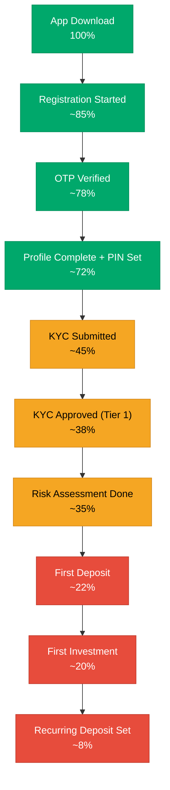

# User Onboarding Flow

## Complete Onboarding Journey

The onboarding flow is designed to get users to their first investment with minimal friction. It follows progressive disclosure: users can browse the app at Tier 0, but must complete KYC (Tier 1) before making any financial transactions.

```mermaid
flowchart TD
    Start["App Download<br/>(App Store / Play Store)"] --> Splash["Splash Screen<br/>Akiba Logo + Tagline"]
    Splash --> Onboarding["Onboarding Slides (3 screens)<br/>1. 'Invest from 1,000 FCFA'<br/>2. 'BRVM stocks, bonds, sukuk'<br/>3. 'Learn as you earn'"]
    Onboarding --> LangSelect["Language Selection<br/>Francais / Wolof / English"]
    LangSelect --> RegScreen["Registration Screen"]

    RegScreen --> EnterPhone["Enter Phone Number<br/>+221 7X XXX XX XX"]
    EnterPhone --> SendOTP["API: POST /auth/register<br/>Send OTP via SMS"]
    SendOTP --> OTPScreen["Enter 6-digit OTP"]
    OTPScreen --> VerifyOTP{"API: POST /auth/verify-otp<br/>OTP valid?"}

    VerifyOTP -->|"Invalid / Expired"| OTPRetry["Show error<br/>'Code invalide'"]
    OTPRetry --> OTPScreen
    VerifyOTP -->|"Valid"| JWTIssued["JWT Tokens Issued<br/>User created at Tier 0"]

    JWTIssued --> BasicProfile["Basic Profile Screen<br/>Full Name + Date of Birth"]
    BasicProfile --> SetPIN["Set 4-digit PIN<br/>(confirm twice)"]
    SetPIN --> Tier0Home["Home Screen (Tier 0)<br/>Can browse markets,<br/>education, prices"]

    Tier0Home --> BrowseMarkets["Browse BRVM assets<br/>View prices + charts"]
    Tier0Home --> StartLearning["Start learning path<br/>'Investing 101'"]
    Tier0Home --> TryDeposit{"User tries to<br/>deposit or invest?"}

    TryDeposit -->|"Yes"| KYCGate["KYC Gate Modal<br/>'Complete identity verification<br/>to start investing'"]
    KYCGate --> KYCFlow["Begin KYC Flow"]

    subgraph KYCProgression["KYC Tier Progression"]
        direction TB
        T0["Tier 0<br/>Phone only<br/>Browse + Learn"]
        T1["Tier 1<br/>ID photo + Selfie<br/>Limit: 200,000 FCFA/day"]
        T2["Tier 2<br/>Full verification + Address<br/>Limit: 2,000,000 FCFA/day"]
        T3["Tier 3<br/>Video call verification<br/>No transaction limit"]

        T0 -->|"Submit ID + Selfie"| T1
        T1 -->|"Proof of address<br/>+ enhanced check"| T2
        T2 -->|"Video call with<br/>compliance officer"| T3
    end

    KYCFlow --> IDCapture["Capture National ID<br/>(Front + Back)"]
    IDCapture --> SelfieCapture["Liveness Selfie<br/>(Smile ID integration)"]
    SelfieCapture --> SubmitKYC["API: POST /users/me/kyc<br/>Upload to S3 + Smile ID"]
    SubmitKYC --> KYCPending["KYC Status: Pending Review<br/>'We'll notify you within 24 hours'"]

    KYCPending --> KYCResult{"KYC Review Result?"}
    KYCResult -->|"Approved"| KYCApproved["Push: 'Identity verified!'<br/>User upgraded to Tier 1"]
    KYCResult -->|"Rejected"| KYCRejected["Push: 'Verification issue'<br/>Show reason + retry option"]
    KYCRejected --> IDCapture

    KYCApproved --> RiskAssessment["Risk Assessment<br/>5 Questions"]

    subgraph RiskQuestions["Risk Assessment Questionnaire"]
        direction TB
        Q1["Q1: Investment horizon<br/>(< 1yr / 1-3yr / 3-5yr / > 5yr)"]
        Q2["Q2: Reaction to 20% loss<br/>(sell all / sell some / hold / buy more)"]
        Q3["Q3: Monthly income bracket<br/>(< 100K / 100-300K / 300K-1M / > 1M)"]
        Q4["Q4: Investment experience<br/>(none / savings only / stocks / diversified)"]
        Q5["Q5: Primary goal<br/>(preserve capital / steady growth / maximize returns)"]
        Q1 --> Q2 --> Q3 --> Q4 --> Q5
    end

    RiskAssessment --> Q1
    Q5 --> CalcProfile["API: POST /users/me/risk-assessment<br/>Calculate risk score"]
    CalcProfile --> ProfileResult{"Risk Profile Result"}

    ProfileResult -->|"Score 5-11"| Conservative["Conservative<br/>70% bonds, 20% treasury, 10% equity"]
    ProfileResult -->|"Score 12-16"| Balanced["Balanced<br/>40% bonds, 25% equity, 20% treasury, 15% funds"]
    ProfileResult -->|"Score 17-20"| Aggressive["Aggressive<br/>50% equity, 25% bonds, 15% funds, 10% treasury"]

    Conservative --> PortfolioReco["Portfolio Recommendation Screen<br/>Shows pie chart of allocation<br/>'We recommend this portfolio<br/>based on your profile'"]
    Balanced --> PortfolioReco
    Aggressive --> PortfolioReco

    PortfolioReco --> AcceptReco{"User accepts<br/>recommendation?"}
    AcceptReco -->|"Yes"| CreatePortfolio["API: POST /portfolios<br/>Create robo-managed portfolio"]
    AcceptReco -->|"Customize"| CustomAlloc["Adjust allocation sliders<br/>Min/max guardrails per risk profile"]
    CustomAlloc --> CreatePortfolio

    CreatePortfolio --> FirstDeposit["First Deposit Screen<br/>'Fund your portfolio'<br/>Suggested: 5,000 / 10,000 / 25,000 FCFA"]
    FirstDeposit --> SelectSource["Select funding source<br/>Wave / Orange Money / Free Money"]
    SelectSource --> ConfirmDeposit["Confirm with PIN"]
    ConfirmDeposit --> DepositInitiated["API: POST /payments/deposits<br/>PI-SPI deposit initiated"]
    DepositInitiated --> WaitConfirm["Waiting screen<br/>'Confirm on your Wave app'"]
    WaitConfirm --> DepositDone["Deposit confirmed via webhook"]
    DepositDone --> FirstInvestment["Auto-invest triggered<br/>Funds allocated per portfolio model"]
    FirstInvestment --> Success["Success Screen<br/>'You're an investor!'<br/>Confetti animation<br/>Show portfolio value<br/>Badge earned: 'First Steps'"]
    Success --> SetupRecurring{"Set up recurring<br/>deposit?"}
    SetupRecurring -->|"Yes"| RecurringSetup["Choose amount + frequency<br/>API: POST /savings/recurring"]
    SetupRecurring -->|"Later"| Dashboard["Main Dashboard"]
    RecurringSetup --> Dashboard

    classDef start fill:#00A86B,stroke:#008F5B,color:#fff
    classDef screen fill:#1A1A2E,stroke:#16213E,color:#fff
    classDef decision fill:#F5A623,stroke:#D4891E,color:#000
    classDef error fill:#E74C3C,stroke:#C0392B,color:#fff
    classDef success fill:#00A86B,stroke:#008F5B,color:#fff
    classDef tier fill:#3498DB,stroke:#2980B9,color:#fff

    class Start,Splash start
    class Onboarding,LangSelect,RegScreen,EnterPhone,OTPScreen,BasicProfile,SetPIN screen
    class Tier0Home,BrowseMarkets,StartLearning,IDCapture,SelfieCapture,KYCPending screen
    class RiskAssessment,PortfolioReco,FirstDeposit,SelectSource,ConfirmDeposit screen
    class WaitConfirm,RecurringSetup screen
    class VerifyOTP,TryDeposit,KYCResult,ProfileResult,AcceptReco,SetupRecurring decision
    class OTPRetry,KYCRejected error
    class KYCApproved,DepositDone,FirstInvestment,Success,Dashboard success
    class T0,T1,T2,T3 tier
```

## KYC Tier Details

```mermaid
graph LR
    subgraph Tier0["Tier 0 -- Phone Only"]
        T0Req["Requirements:<br/>Phone + OTP verified"]
        T0Can["Can do:<br/>Browse markets<br/>View prices<br/>Education content<br/>Set up profile"]
        T0Limit["Limits:<br/>No deposits<br/>No withdrawals<br/>No investments"]
    end

    subgraph Tier1["Tier 1 -- Basic KYC"]
        T1Req["Requirements:<br/>+ National ID (front + back)<br/>+ Liveness selfie<br/>+ Smile ID verification"]
        T1Can["Can do:<br/>Everything in Tier 0<br/>+ Deposits<br/>+ Withdrawals<br/>+ Investments<br/>+ Savings goals"]
        T1Limit["Limits:<br/>200,000 FCFA/day<br/>1,000,000 FCFA/month"]
    end

    subgraph Tier2["Tier 2 -- Full KYC"]
        T2Req["Requirements:<br/>+ Proof of address<br/>+ Enhanced ID verification<br/>+ Source of funds declaration"]
        T2Can["Can do:<br/>Everything in Tier 1<br/>+ Higher limits<br/>+ Self-directed trading"]
        T2Limit["Limits:<br/>2,000,000 FCFA/day<br/>10,000,000 FCFA/month"]
    end

    subgraph Tier3["Tier 3 -- Enhanced"]
        T3Req["Requirements:<br/>+ Video call with<br/>compliance officer<br/>+ Additional documentation"]
        T3Can["Can do:<br/>Everything in Tier 2<br/>+ Unlimited transactions<br/>+ Premium features"]
        T3Limit["Limits:<br/>No transaction limit<br/>Subject to AML monitoring"]
    end

    Tier0 -->|"Submit ID + Selfie"| Tier1
    Tier1 -->|"Submit address proof"| Tier2
    Tier2 -->|"Complete video call"| Tier3

    classDef t0 fill:#E9ECEF,stroke:#6C757D,color:#000
    classDef t1 fill:#3498DB,stroke:#2980B9,color:#fff
    classDef t2 fill:#F5A623,stroke:#D4891E,color:#000
    classDef t3 fill:#00A86B,stroke:#008F5B,color:#fff

    class Tier0,T0Req,T0Can,T0Limit t0
    class Tier1,T1Req,T1Can,T1Limit t1
    class Tier2,T2Req,T2Can,T2Limit t2
    class Tier3,T3Req,T3Can,T3Limit t3
```

## Risk Score Calculation

Each answer maps to a numeric value (1-4). The total score determines the risk profile:

| Question | Option A (1pt) | Option B (2pt) | Option C (3pt) | Option D (4pt) |
|----------|----------------|----------------|----------------|----------------|
| Investment horizon | < 1 year | 1-3 years | 3-5 years | > 5 years |
| Reaction to 20% loss | Sell everything | Sell some | Hold steady | Buy more |
| Monthly income | < 100K FCFA | 100-300K FCFA | 300K-1M FCFA | > 1M FCFA |
| Experience | None | Savings only | Some stocks | Diversified portfolio |
| Primary goal | Preserve capital | Steady income | Growth | Maximize returns |

| Total Score | Risk Profile | Portfolio Strategy |
|-------------|-------------|-------------------|
| 5-11 | Conservative | Heavy bonds + treasury bills, minimal equity exposure |
| 12-16 | Balanced | Mix of bonds, equities, and mutual funds |
| 17-20 | Aggressive | Equity-heavy with growth-oriented allocation |

## Halal Filter

At any point during onboarding or later in settings, users can enable the `isHalalOnly` flag. When enabled:

- Only Sharia-compliant assets are shown in the market catalog
- Portfolio recommendations exclude non-compliant securities
- Sharia screening criteria are applied: debt ratio < 33%, interest income < 5%, haram revenue < 5%, receivables < 49%
- Sukuk instruments are prioritized over conventional bonds
- The screening is refreshed quarterly per the `sharia_last_screened` field on each asset

## Onboarding Metrics

The onboarding funnel tracks conversion at each step:

