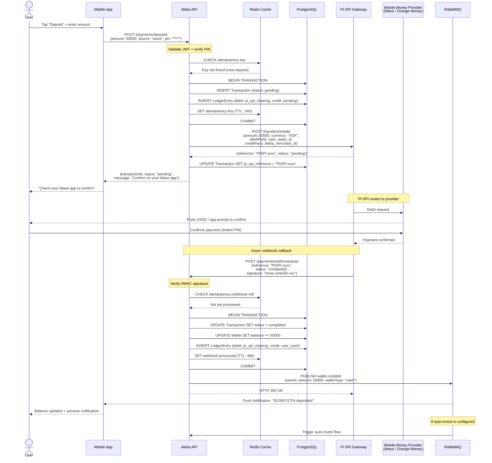
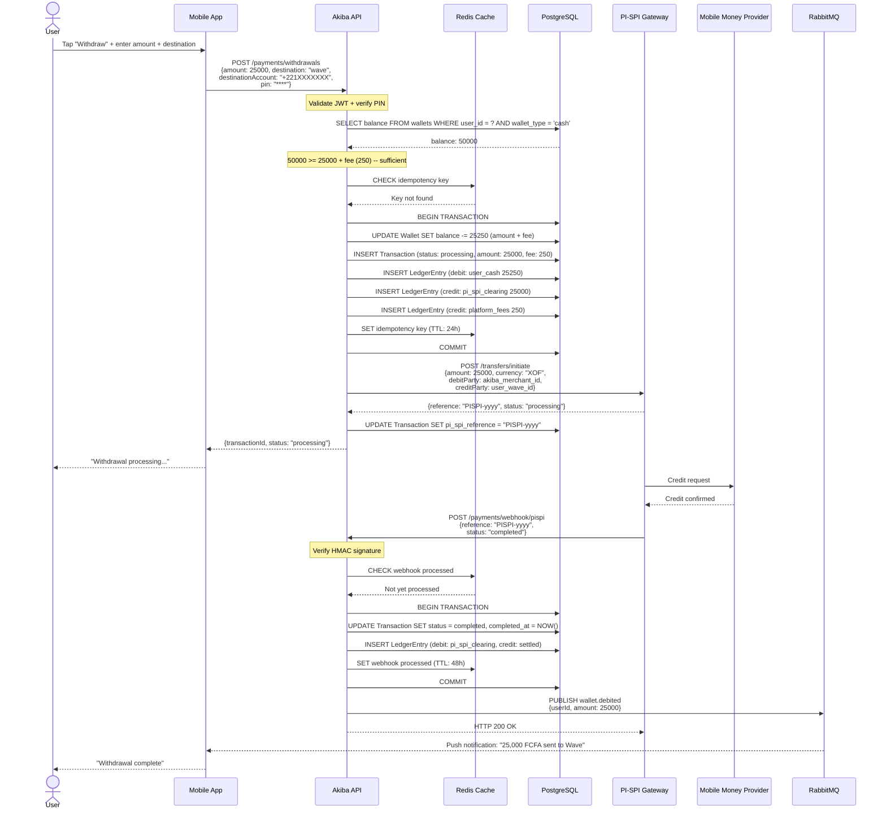
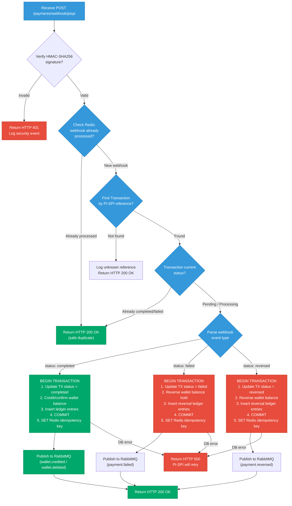
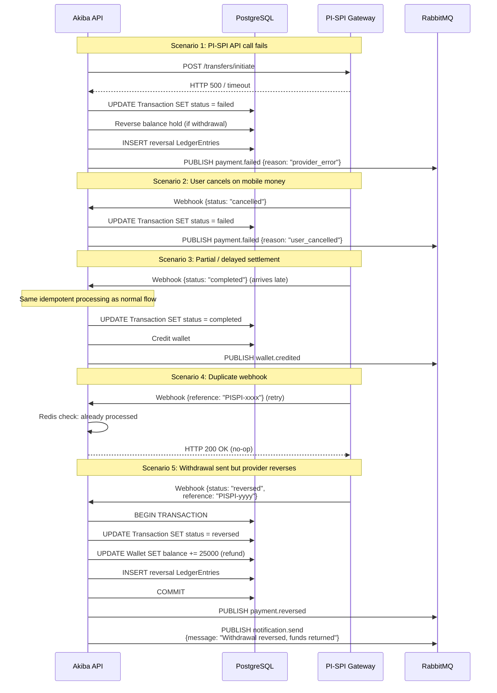

# PI-SPI Payment Flow Diagrams

## Overview

Akiba processes all deposits and withdrawals through the BCEAO PI-SPI (Plateforme d'Interoperabilite du Systeme de Paiement Instantane) gateway, which provides instant interoperable payments across mobile money providers (Wave, Orange Money, Free Money) and bank accounts within the WAEMU zone. All amounts are denominated in XOF (CFA Franc).

## Deposit Flow

When a user deposits funds from their mobile money wallet into their Akiba cash wallet:

## Withdrawal Flow

When a user withdraws funds from their Akiba cash wallet to their mobile money account:

## Webhook Handling with Idempotency

The webhook handler is designed to be safely retried by PI-SPI. Every webhook delivery is deduplicated using the PI-SPI reference as an idempotency key.

## PI-SPI Retry Policy

PI-SPI retries webhook delivery using exponential backoff when it does not receive an HTTP 200 response:

| Attempt | Delay | Cumulative Wait |
|---------|-------|-----------------|
| 1 | Immediate | 0s |
| 2 | 30 seconds | 30s |
| 3 | 2 minutes | 2m 30s |
| 4 | 10 minutes | 12m 30s |
| 5 | 1 hour | 1h 12m 30s |
| 6 | 4 hours | 5h 12m 30s |
| 7 (final) | 24 hours | 29h 12m 30s |

After all retries are exhausted, the transaction remains in `processing` status and requires manual reconciliation via the admin dashboard.

## Error Scenarios and Rollback

## Double-Entry Ledger Examples

Every financial operation produces balanced ledger entries. The `LedgerEntry` table ensures that debits always equal credits.

### Deposit (50,000 FCFA)

| Account | Debit | Credit |
|---------|-------|--------|
| `pi_spi_clearing` | 50,000 | |
| `user_cash:{userId}` | | 50,000 |

### Withdrawal (25,000 FCFA + 250 FCFA fee)

| Account | Debit | Credit |
|---------|-------|--------|
| `user_cash:{userId}` | 25,250 | |
| `pi_spi_clearing` | | 25,000 |
| `platform_fees` | | 250 |

### Investment Purchase (10,000 FCFA + 100 FCFA fee)

| Account | Debit | Credit |
|---------|-------|--------|
| `user_cash:{userId}` | 10,100 | |
| `user_investment:{portfolioId}` | | 10,000 |
| `platform_fees` | | 100 |

### Withdrawal Reversal (25,000 FCFA refund, fee waived)

| Account | Debit | Credit |
|---------|-------|--------|
| `pi_spi_clearing` | 25,000 | |
| `platform_fees` | 250 | |
| `user_cash:{userId}` | | 25,250 |
